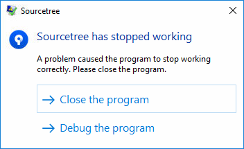
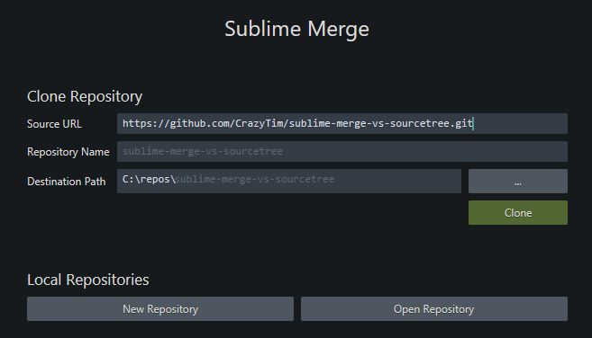
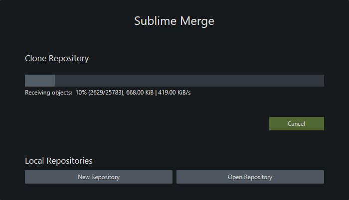
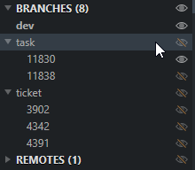
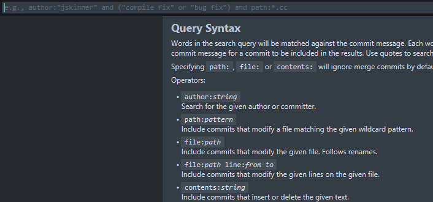

# Sublime Merge vs SourceTree (Git client comparison)

The main point of this article is to point out the amazing features in Sublime Merge, and to illustrate why you should avoid using Sourcetree. I hope my comments help to further improve both tools.

[Download Sublime Merge now!](https://www.sublimemerge.com)

Note: my experience is with the Windows versions of Sublime Merge and Sourcetree. Mileage may vary on OSX or Linux.

## What's wrong with Sourcetree?

- Slow.

- Regularly crashes and needs to be reinstalled (or requires a reboot), usually just after updating Microsoft Office.

  

- Regularly complains about corrupt dictionaries and asks if I want to delete them.

- Regularly prompts for authentication for each repo separately (very frustrating).

- Sometimes when you click on a branch it doesn't jump to it in the graph view. Need to click on/off twice.

## What's so amazing about Sublime Merge?

I have used Sourcetree for over a year and during that time I was still learning git. After switching to Sublime Merge my knowledge of git exploded and it has been a great discovery process. Sublime Merge is a great tool and its features helped me learn git and made my workflow faster.

Below I've explained each awesome feature, followed by a comparison with SourceTree.

Please also head over to their website and read the [feature highlights](https://www.sublimemerge.com). 

- Its lightning fast.

  *(Sourcetree is a turtle in comparison)*

- The entire interface is consistent and elegant.

  *(Sourcetree is clunky)*

- It has a dark theme.

  *(Sourcetree doesn't have this feature)*

- Back/Forward navigation buttons.

  *(Sourcetree doesn't have this feature)*

- `Ctrl`+`Click` any two commits to see a diff of them.

  *(Sourcetree can do this, but its unreliable and usually doesn't give the correct result)*

- Interactive rebase commands are performed individually, and this works out to be very intuitive from a GUI. Simply select one or more commits, then use the context menu to squash, reorder, drop, amend commit message, etc.

  

  *(The Interactive rebase interface in Sourcetree is vague and unintuitive)*

- The GUI has clear indicators to show when you are currently rebasing. You can refer to the last git command, and there are buttons to `Abort rebase` or `Continue rebase`.

	

	

	*(Sourcetree doesn't have clear indicators that a rebase is in progress. The rebase commands to abort or continue are hidden 2 deep in a menu.)*

- Cloning a repo is wonderfully simple - you can do it in two clicks:

  

  

  *(In Sourcetree there are many clicks and confusing options, and its so slow performing the clone)*
  
- The work flow for resolving merge conflicts is very streamlined:

  

  *(The workflow in Sourcetree is vague and unintuitive)*
  
- Tool tips on some buttons show what git commands will be executed when you press them (this helps you learn git).

  

  

  *(Sourcetree hides most of the git internals, so you need to experiment. Labels are poorly written too, which makes it scary for learners)*

- The full path to the repo is shown in the Window title.

  *(Sourcetree doesn't have this feature)*

- Its possible to open multiple windows if that's what you need.

  *(Sourcetree opens repos as tabs inside a single window, so you can't do a side-by-side of two repos)*

- Instantly switch to another repo using `Shift`+`Ctrl`+`O`. Sublime Merge remembers the last dozen or so repos you opened.

  *(Sourcetree gets slower the more repo tabs that are open. Trying to open a repo you've opened before is painful.)*

- The checked-out branch name is prominent at the top of the window:

  

  *(Sourcetree only bolds the branch name, which is hard to see with lots of branches)*

- Easily inspect the state of any file as of a certain commit (`Right-Click` on a commit > `View Tree`). Each file is shown as a "blame" view and it is lightning fast. You can see the relative age of each line, and hover over the line to get more info about the commit.

  *(Sourcetree blame isn't as flexible. You need to blame files individually using `right-click` menus. Sourcetree calls blame "Annotate" (deprecated term), and it opens in a new window (which could be handy)).*

- Diff shows you the individual characters that have changed.

  *(Sourcetree doesn't have this feature)*

- Easy to copy text from the diff view (SourceTree only allows you to copy line-by-line).

  

- Hide/show individual local/remote branches.

  

- Powerful find (`Ctrl`+`F`), and there is a query syntax:

  

  *(Sourcetree search is slow, uninspiring, and mostly gives inaccurate results)*

- The layout adjusts well when the window is resized and everything stays in place.

  *(Occasionally the Sourcetree window can't be dragged, panels get stuck and cant be resized, and panels adjust using percentages. Also the commit message panel doesn't resize automatically like Sublime Merge.)*

- The graph design is nice and simple. You can collapse merged branches as well, which is nice.

  
  
- Diff view changes to 2 columns when the window is large enough. I think its easier to read diffs with two columns, but it takes up more screen space so I only use it when the diff looks confusing).

  *(Sourcetree doesn't have this feature)*

- You can see stashes in the graph.

  *(Sourcetree doesn't have this feature)*

- Installation is dead simple.

  *(Source tree requires you to register with a BitBucket account, plus several other steps)*

- You can adjust the number of lines of context before/after a particular diff by `double-clicking` on the top/bottom border of the diff, or alternatively `drag` the border up/down (how cool is that!).

  *(Sourcetree only lets you choose from certain presets (1, 3, 6, etc), and this applies to every diff)*

- Automatically saves a draft of your commit message after all windows are closed you close the app.

	*(Sourcetree only saves a draft when switching tabs, and I have lost several detailed commit messages because of this)*

- You can undo/redo git actions in the `Repository` menu.

  

	*(Sourcetree doesn't have this feature)*

- Use `Ctrl`+`Shift`+`Z` to undo in the commit message text box.

	*(Sourcetree doesn't have this feature, need to use `Ctrl`+`Y`)*

- A progress bar is shown for predictable operations, such as merges or pushes.

  

	*(Sourcetree always shows an animated progress bar with no progress being indicated)*

- You can cancel an operation if you accidentally did it in haste (such as pushing changes) by clicking the little `x`:

  

  *(Sourcetree doesn't have this feature)*

- To navigate quickly to the current changes (staged/unstaged) view, press `Ctrl`+`1`.

	*(Sourcetree has this feature)*

## What are some features I wish Sublime Merge had?

- [coming soon!]

## License

See the [License File](./LICENSE.md).
